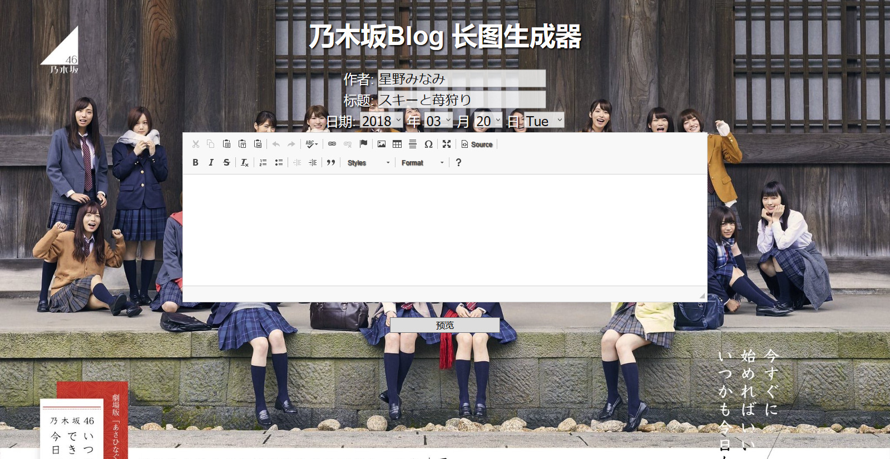
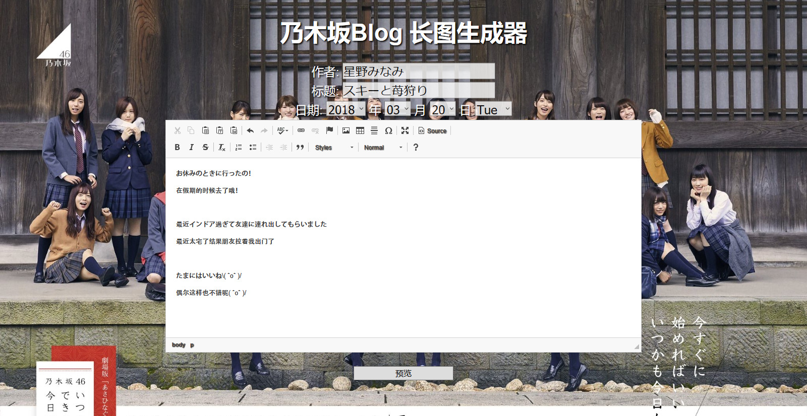
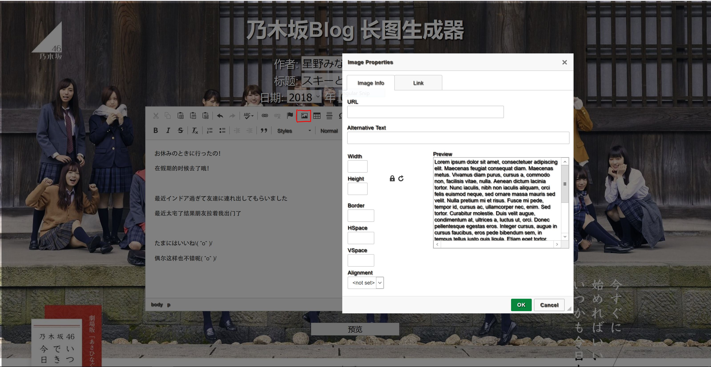
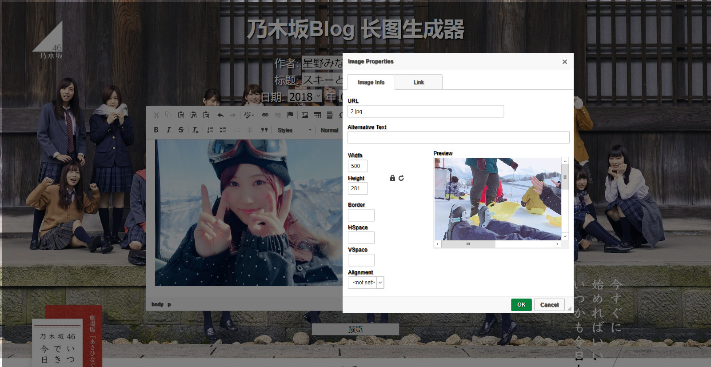
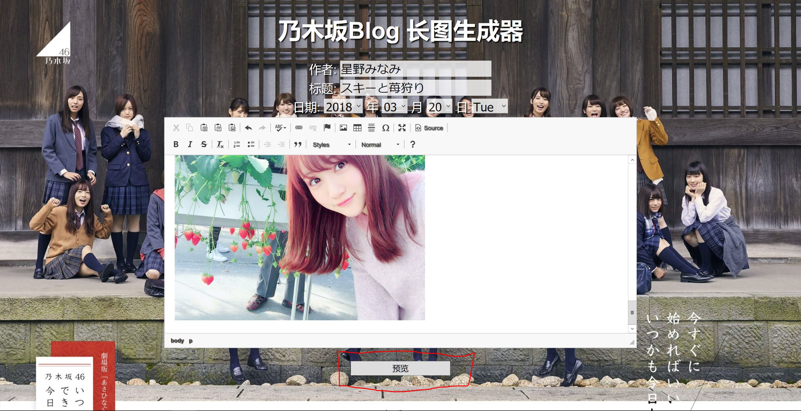
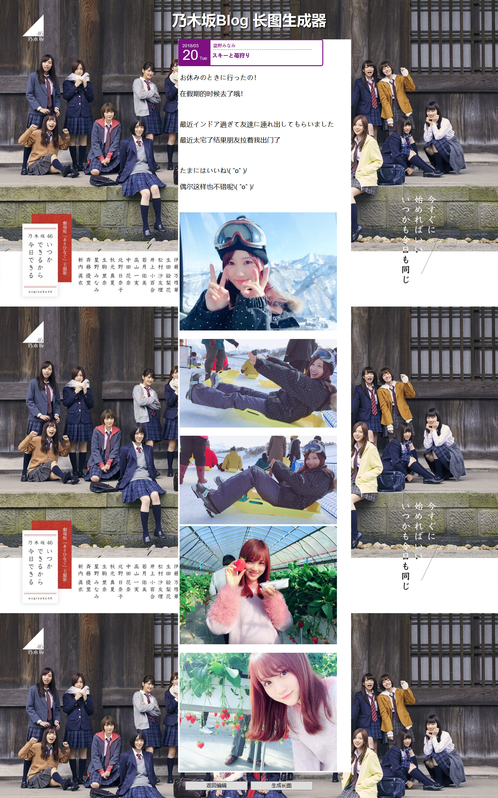
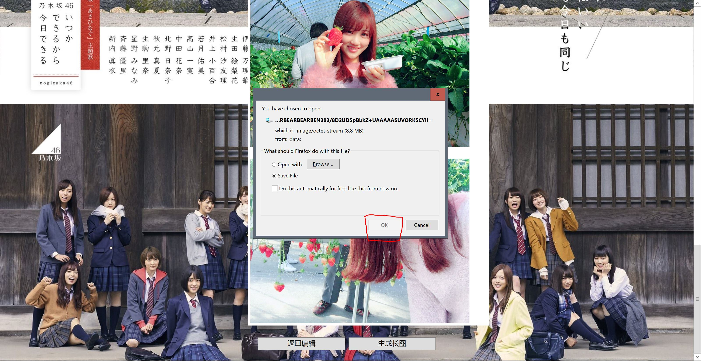
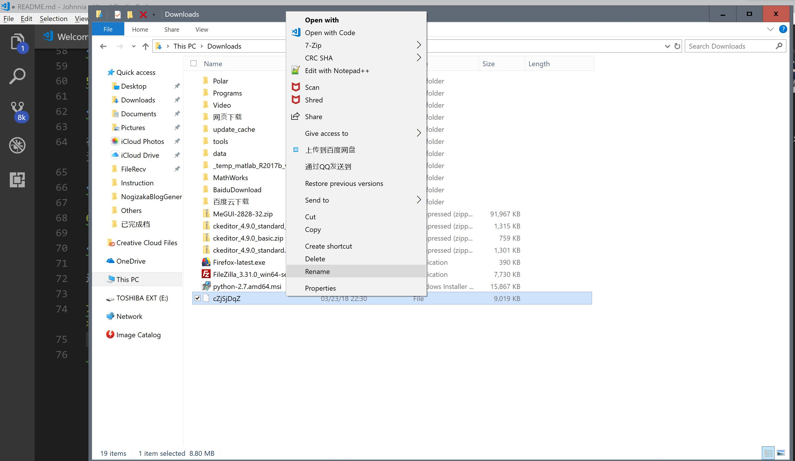
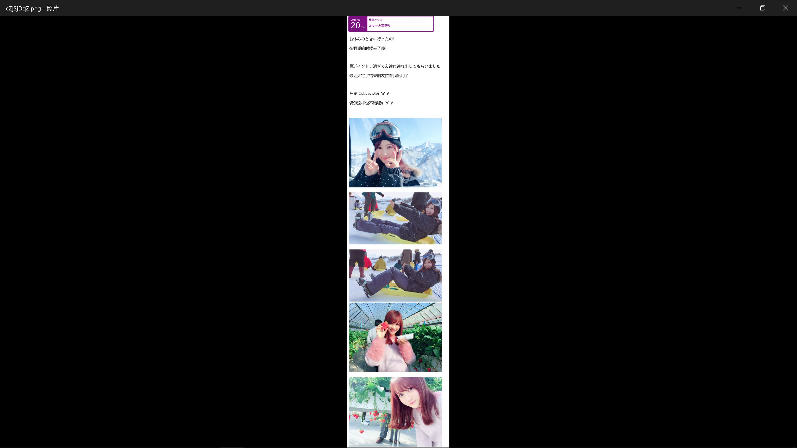

# Nogizaka Blog Generator

乃木坂博客长微博生成器

Long Weibo Generator for Nogizaka Blogs

### cred [@星野面面包](https://weibo.com/hoshinominami)

## 需求 Requirement
+ IE 9.0 or higher
+ FireFox (Up to Date) 64/32 bit (**推荐**）
+ Google Chrome (Up to Date)
+ Java SE (Up to Date)
+ Node.js (若要使用 ``html2canvas.min.js``)
+ Git

## 安装 Installation

```
$git clone NogizakaBlogGenerator
```

或手动下载


## 使用说明 Instruction (For Windows)

1. 成功安装后

* 如果是使用git安装在默认路径

    可以在`C:\Users\Username\NogizakaBlogGenerator`中找到。Username是你本地的用户名

* 如果手动下载或是使用git安装在特定文件夹

    在`Your_Directory\NogizakaBlogGenerator`中可以找到。

2. 双击`BlogGenerator.html`， 你可以看到下图


在作者栏，标题栏填入相应作者与标题，选择年月日与星期。



3. 在输入框中填入文字



4. 添加图片

    **注意：因为`html2canvas`尚不支持跨域图片（与网页不同服务器的图片），`ckeditor`尚不支持本地的绝对路径absolute path，所以必须要将需要插入的图片存在本地且与`BlogGenerator.html`同一文件夹内，然后用相对路径relative path引用。只需要在同一文件夹内即可，并不一定需要将图片放在文件夹的根目录下**



在URL栏中输入相对路径后，Width和Height会被自动提取出，然后需要将Width修改至小于550px以适应截图。在Lock Ratio的锁锁上时，宽高会自动匹配至原比例。


5. 添加完文字与图片后点击输入框下方的预览



在预览界面你可以进行预览，如果需要修改点击下方的返回编辑，如果无误，点击生成长图



6. 在加载后会有弹窗(FireFox)



选择OK

7. 默认的下载文件夹中会出现一个没有后缀extension的File文件，将其重命名为.png文件



8. 完成




## 使用插件 Package Used

`html2canvas.js` https://github.com/niklasvh/html2canvas/

`canvas2image.js` https://github.com/hongru/canvas2image

`ckeditor 4` https://ckeditor.com/ckeditor-4/

## 更新日志 Developer's Log

* 2018/03/23 更新Beta版 Ver 0.0.1
